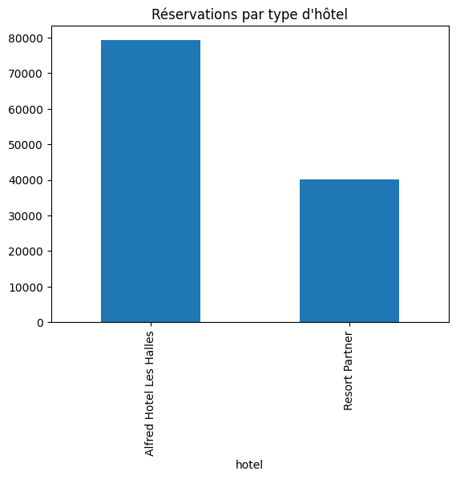
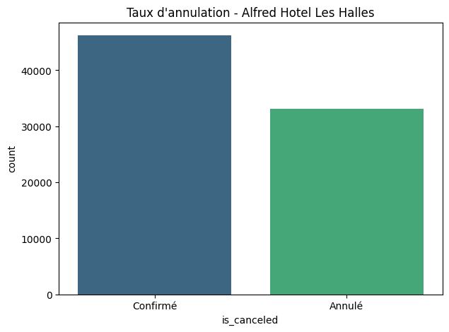
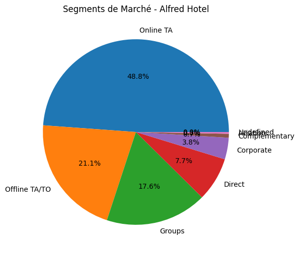

Hotel Booking Data Analysis & Business Intelligence
Ce projet propose une analyse complète des données de réservation hôtelière pour l'établissement Alfred Hotel Les Halles (Biarritz). L'objectif est d'extraire des insights stratégiques pour optimiser la gestion des revenus et comprendre le comportement des clients.

Aperçu du Projet
Le projet combine l'analyse de données avec Python, le reporting via Excel et la visualisation interactive avec Power BI.

Visualizations
Booking Distribution

Cancellation Analysis

Market Segments

Dataset : Hotel Booking Demand (Kaggle)

Focus : Performance de l'Alfred Hotel (City Hotel)

1. Analyse avec Python (EDA)
Le script Python (alfred_hotel_analysis.ipynb) traite les données brutes pour extraire les tendances principales.

Bibliothèques : Pandas, Matplotlib, Seaborn.
Points clés : Analyse des taux d'annulation, étude de la saisonnalité et calcul de l'ADR moyen.

2. Dashboard Power BI (Interactif)
J'ai conçu un tableau de bord interactif pour permettre aux décideurs de filtrer les données par année et par segment de marché.
Aperçu du Dashboard : 

KPI Cards : Affichage en temps réel de l'ADR moyen et du volume de réservations.
Segments de Marché : Analyse de la provenance des clients (Online TA, Direct, etc.).
Filtres (Slicers) : Filtrage dynamique par année (arrival_date_year).

Reporting Excel
Un dashboard Excel a été créé pour une consultation rapide des indicateurs de performance (KPIs) sous forme de tableaux croisés dynamiques.

Aperçu Excel : 

Compétences Démontrées
Data Cleaning : Manipulation de données avec Python.
Business Intelligence : Création de visuels percutants avec Power BI.
Reporting : Capacité à synthétiser des données complexes pour le management.
Langues : Projet documenté en Français pour répondre aux besoins du marché local.

Structure du Repo
alfred_hotel_analysis.ipynb : Script d'analyse Python.
Alfred_Hotel_Dashboard.pbix : Fichier source Power BI.
Alfred_Hotel_Analysis_Dashboard.xlsx : Dashboard Excel.
hotel_bookings.csv : Dataset utilisé.

## Business Intelligence & Reporting
Beyond Python analysis, this project includes a professional dashboard designed for hotel management:

- **Excel Dashboard:** Strategic KPIs including ADR, Cancellation Rates, and Market Segmentation.
- **Key Metrics:** - Monitoring of high-volume segments (Online TA).
  - Comparative analysis: Alfred Hotel Les Halles vs. Market Partners.
